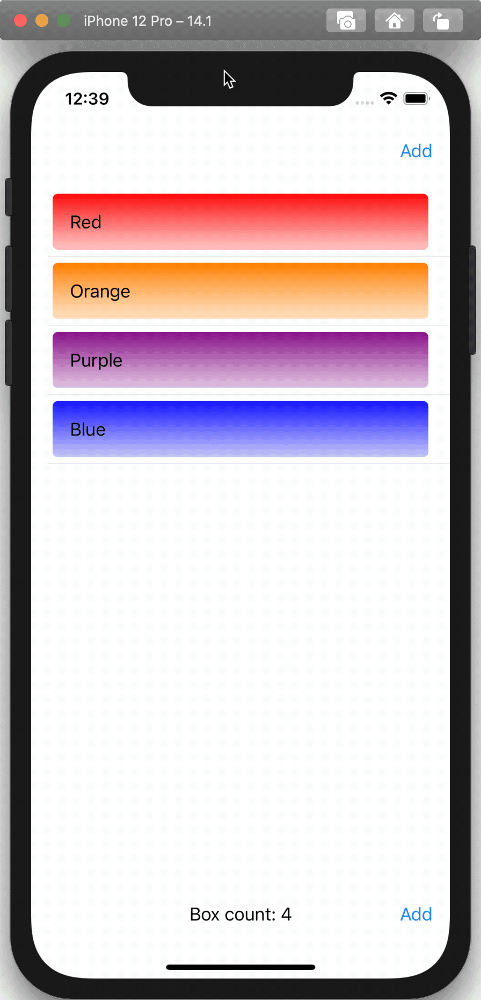

# SwiftUI State Management: Time Travel PoC

Simple proof of concept app demonstrating time travel with SwiftUI state.

## Overview

 

App state is a list of colored boxes. State can be changed by adding more boxes.

Double tapping brings up the history browser bar.

User can go backwards and forwards in state history using Prev and Next buttons.
